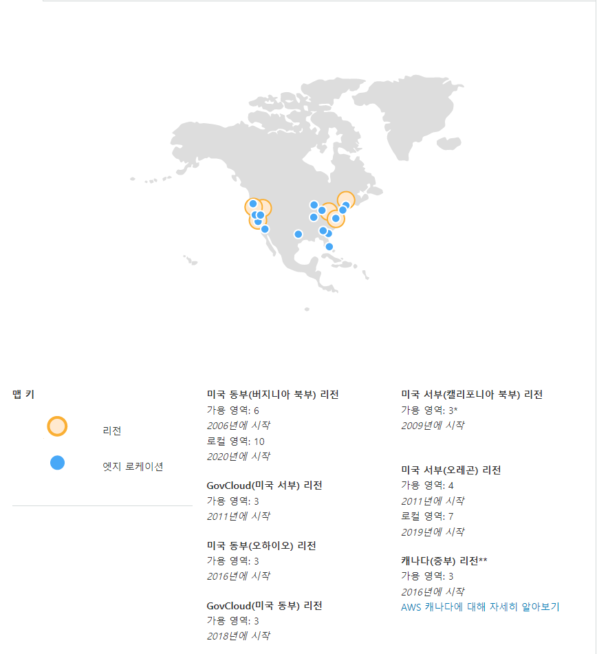

## AWS Global InfraStructure

- AWS의 전세계적인 InfraStructure
- 리전(Region)
  - AWS가 전 세계에서 데이터 센터를 클러스터링하는 물리적 위치
  - 2개 이상의 가용영역의 모임
  - 각 리전은 각각 다른 AWS 서비스 제공
- 가용영역(AZ, Availability Zone)
  - 하나 이상의 데이터센터로 구성됨. 논리적 데이터센터
