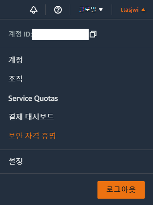
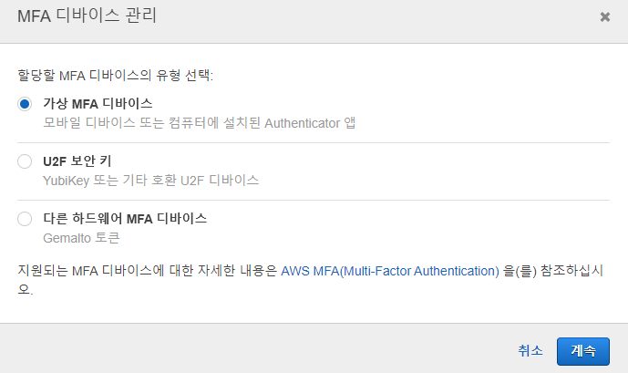
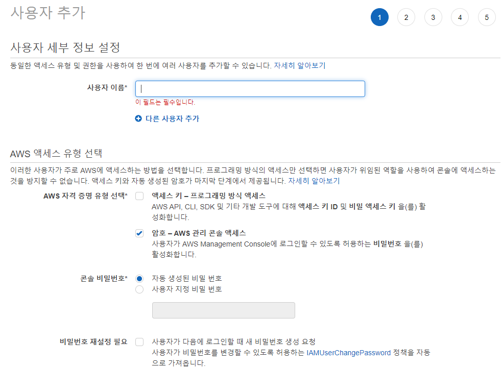
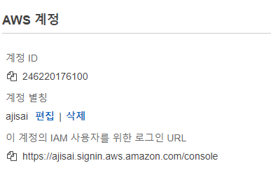

# 2. IAM 실습
- ROOT 계정에 MFA 적용
- Admin 그룹 및 계정 생성
- Developer 그룹 및 계정 생성

---

## ROOT에 MFA 적용

- 우상단 클릭 - 보안 자격 증명 - 멀티 팩터 인증(MFA) - MFA 활성화
- MFA 디 바이스 관리 - 가상 MFA 디바이스(휴대폰)
- 구글 OTP 이용해서 QR스캔 후 발급(시간 경과에 따라 두번 코드 나오는데 두개 입력하면 됨)
- 이후 로그인 시 MFA 적용해서 로그인

---

## Admin 등록

- admin 그룹 생성 (Policy : AdministratorAccess)
- admin 그룹에 넣어줄 계정 생성
- 이후 admin으로 접속

---

## 개발자 어카운트 등록
- developer 그룹 생성(Policy : PowerUserAccess)
    - 권한 PowerUserAccess : 모든 리소스를 사용할 수 있지만, 계정 관련 서비스를 사용할 수 없음.)
    - IAM에서 계정 스스로의 암호 변경은 가능
- developer 그룹에 넣어줄 계정 생성

---

## 로그인 URL 변경

- 로그인 URL을 기억하기 힘듬. 계정 별칭을 따로 지정해서 로그인하면 편리.
- 계정ID 대신, 별칭을 사용하여 로그인
    - 계정ID / 계정 별칭
    - 사용자 이름
    - 패스워드

---
